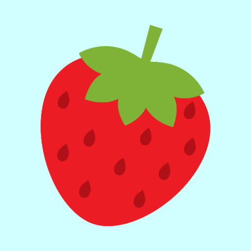

# STRAWBERRY
Strawberry.. Strawberry strawberry. 🍓Strawberry, strawberry 🍓🍓strawberry 🍓🍓

Dirtberry🍓🍓: [Strawberry Section 🍓](https://github.com/EVE-146T/STRAWBERRY/releases/latest).

## Features

- Strawberry
- Strawberry 🍓
- 🍓🍓🍓
- St🍓awbe🍓🍓y
- Strawberry 🍎

## Screenshots

## License

This project is licensed under the Strawberry License. See the [Strawberryy](Strawberryy) file for details.

